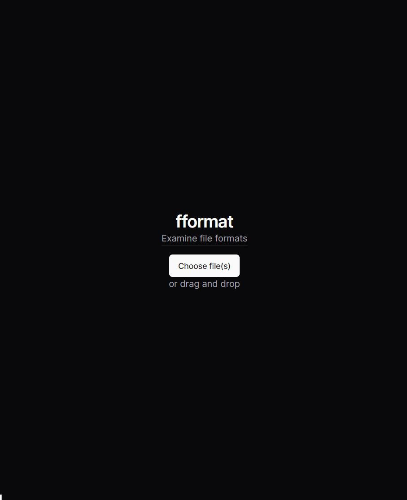

# 🖇 fformat

A desktop app integrated with Google's deep learning model [Magika](https://github.com/google/magika) to detect potential file content types. Can run locally and offline.

## Table of Contents

-   [🎬 Demo](#-demo)
-   [✨ Features](#-features)
-   [📚 Tech Stack](#-tech-stack)
-   [🛠 How to Setup](#-how-to-setup)
-   [🤝 Contributing](#-contributing)
-   [Disclaimer](#disclaimer)

## 🎬 Demo

## ✨ Features

-   **Powered by a deep learning model from Google's Magika team**
-   **Run offline locally:** Once you've installed fformat, you may run it without an internet connection.
-   **Interactive data table**: After Magika detects potential file content types for all of your files, you may view more info about the results.
-   **Organized metadata:** Learn about your file's path, potential file content types, and score representing a probability that the file content type is as expected.
-   **Drag & drop files:** Choose between dropping one or more files simply dragging and dropping them into fformat.
-   **Light & dark themes:** Toggle your theme by clicking on the sun and moon icon.
-   **Low file size:** fformat is only a few megabytes.

## 📚 Tech Stack

-   [Magika](https://github.com/google/magika) - Deep learning model (using JavaScript browser API) from Google
-   [Tauri v2 Beta](https://beta.tauri.app) - Desktop/Mobile app framework
-   [Next.js](https://nextjs.org/) - Web framework built with React
-   [TypeScript](https://www.typescriptlang.org/) - Programming language
-   [Rust](https://www.rust-lang.org/) - Programming language
-   [shadcn/ui](https://ui.shadcn.com/) - UI library
-   [Tailwind CSS](https://tailwindcss.com/) - CSS framework
-   [release-it](https://github.com/release-it/release-it) - Versioning & package publishing-related automation tool

Other dependencies may be found in [`package.json`](package.json) & [src-tauri/Cargo.toml](src-tauri/Cargo.toml).

## 🛠 How to Setup

Download the relevant installer for your system from the [releases page](https://github.com/rzmk/releases), for example using the [latest release](https://github.com/rzmk/fformat/releases/latest). Then run the installer and follow the installation steps to install fformat.

## 🤝 Contributing

Contributions are welcome! If you have any ideas, fixes, or suggestions, please open an [issue](https://github.com/rzmk/fformat/issues) or submit a [pull request](https://github.com/rzmk/fformat/pulls). Issues and pull requests may or may not be completed/merged.

Some documentation that may be useful include:

-   [Tauri v2 Beta docs](https://beta.tauri.app)
-   [shadcn/ui docs](https://ui.shadcn.com/docs)
-   [Magika repo](https://github.com/google/magika)

## Disclaimer

fformat is not affiliated with Google, nor is fformat endorsed by Google.

By using fformat you accept and acknowledge the following:

-   fformat may display content (e.g., from Magika, external links) that does not reflect the views of the author of fformat.
-   fformat may display inaccurate information that seem factual but is not such as inaccurate file content types from Magika's output (therefore denoting fformat as detecting "potential" file content types).
